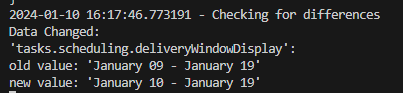

# TeslaOrderChecker

TeslaOrderChecker is a simple tool designed to periodically check for changes in Tesla vehicle orders. It utilizes the Tesla API to monitor your order status.

## Features
- **Automatic Checking**: Calls the Tesla API every 10 minutes to detect any updates in the order.
- **Local storage of last data**: To notify you of changes while the script was not running.
- **Notifications**: Optional support for Apprise notifications.

## Prerequisites
- **Tesla Account Refresh Token**: Obtain your token using [Tesla Auth](https://github.com/adriankumpf/tesla_auth).
- **Reservation Number**: Your Tesla reservation number, starting with RN.

## Setup
1. Clone the repository. (`git clone https://github.com/WesSec/teslaorderchecker && cd teslaorderchecker`)
2. Install required dependencies (`pip install -r requirements.txt`).
3. `cp config.json.sample config.json` and fill the json file with your variables.
4. Setup the [apprise](https://github.com/caronc/apprise) string in main.py and set `notificationwanted` to `True`

## Usage
Run the script with `python main.py` and wait :) 

## Disclaimer
- Not affiliated with Tesla, Inc.
- Use at your own risk.

*This tool is for informational purposes only.*

